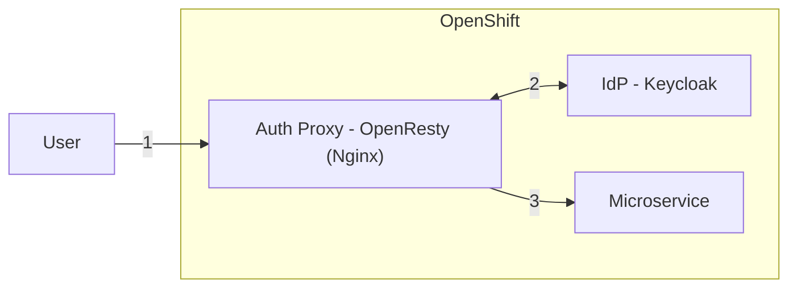

# Architecture

# Setup Keycloak
[Get started with Keycloak on OpenShift (keycloak.org)](https://www.keycloak.org/getting-started/getting-started-openshift)

# URLs
Keycloak: https://keycloak-keycloak.apps-crc.testing
Keycloak Admin Console: https://keycloak-keycloak.apps-crc.testing/admin
Keycloak Account Console: https://keycloak-keycloak.apps-crc.testing/realms/<myrealm>/account
